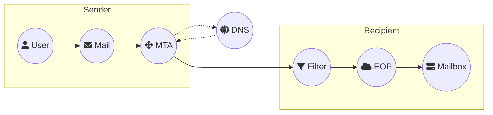
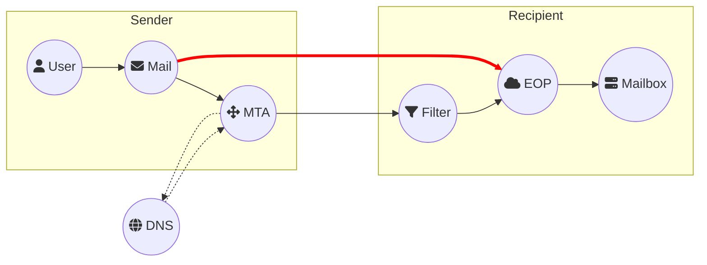
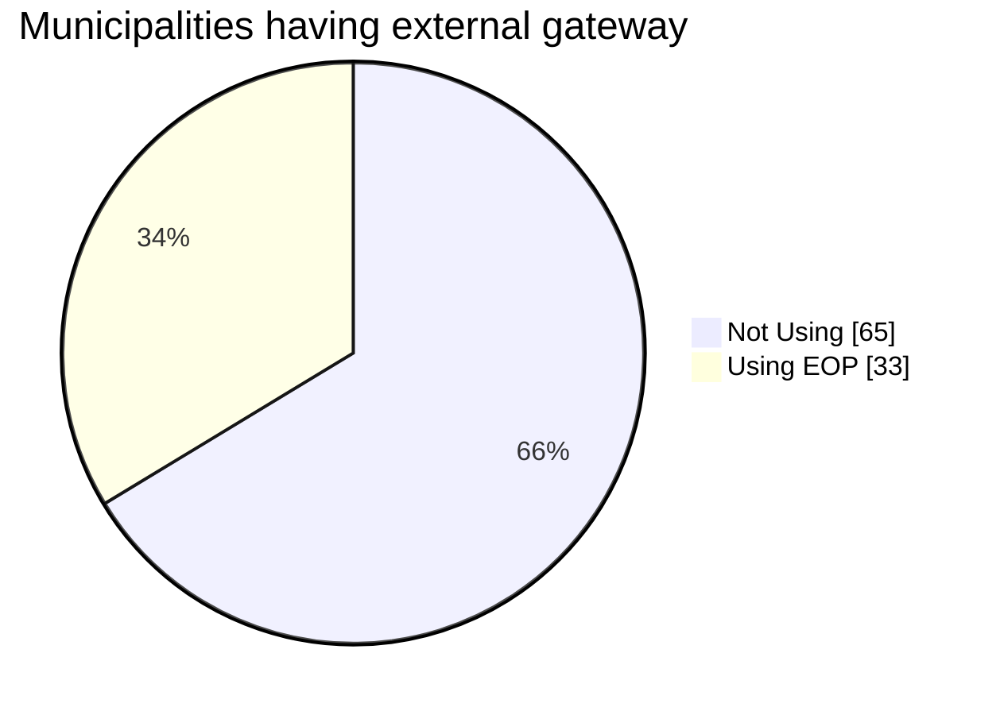
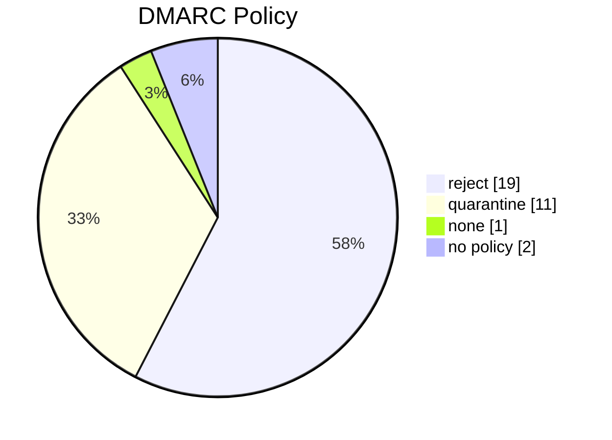

So... Yet another writing about email spoofing. I know the subject is quite common, but based on my research and testing, my results are scary to put it mildly! As of writing I've managed to get an email through in close to 90% of my tests. Among those mails, close to 85% of them was delivered directly to the inbox, 10% as NDR and the last 5% somehow managed to end in junk.

Through my consultancy and incident response work, I came across this misconfiguration, allowing a threat actor to craft and send spoofed mails into an organization, even with mechanisms such as SPF and DMARC in place.

This article’s goal is to describe the issue, what is causing it and come up with potential solutions based on the knowledge I have obtained so far. Please advise, I am no Microsoft Expert in mail flows, therefore if I am wrong, misinformed, or similar, please let me know!

## Key Takeaways

In short terms, threat actors deliver the mail directly to Exchange Online Protection with no respect to the domains Mail Exchange (MX) record.

1. Threat actors are currently abusing this misconfiguration, allowing them to send spoofed mails and successfully getting them delivered. Currently seen used to do CEO-fraud and perform extortion schemes.
2. Organizations with external mail gateways not using Exchange Online Protection (EOP), tend to be the most common architecture exploitable.
3. Having implemented DMARC with the policy of `reject` and using EOP, tends to allow a kind of successful attack, bypassing safe links, without any great mitigation if you are using Exchange Online Protection.
4. Please ***test*** if you are vulnerable to this no matter what! The above are just the expected results. Unexpected results still occur due to poorly configured mail flows, causing a successful exploit even when it is not the expected result.

## Technical details

A normal (oversimplified) mail flow having an external mail gateway in front of Exchange Online looks like below. Looks good, right?

- User crafts a mail going to a recipient e.g., `bob@acme.com`
- The mail is sent through the users Mail Transport Agent (MTA).
- The MTA look up the Mail Exchange (MX) with DNS for the domain `acme.com`
- MTA delivers the mail to the recipient’s mail filtering solution
- Filtering solution scans the mail and deliver to Exchange Online
- Exchange Online delivers to the user mailbox (can be on-prem or cloud)



### The misconfiguration

{: .shadow .right}

So, what's the issue you may ask? Let me try to explain! Continuing from the previous example, again, just to be clear, it is in (over)simplified terms!

What if the Threat Actor ignored the MX record and took their mail directly to Exchange Online Protection?
EOP will likely not scan mails due to the expectation that this would have been done by the mail filtering solution.
Sysadmins and support staff will not and shouldn't manage spam filters multiple places, but along the way forgot the security architecture along the way.
If you've ever browsed Microsoft Documentation, there are a lot of hidden gems, hereunder how to configuration this architecture correct. More on that later.

For now, the flow for a threat actor abusing the misconfiguration will look like this.



That should not be possible, or should it? Well, it is! There is only one "challenge". Getting the domain for Exchange Online Protection belonging to the target tenant.
This is (un)luckily quite straight forward to obtain with `Get-AADIntTenantDomains`[^aadinternals]. Shout out to [@DrAzureAD](https://twitter.com/drazuread) for awesome tooling!.

_Below is just an example and does not reflect actual world results!_

```powershell
Import-Module AADInternals
Get-AADIntTenantDomains -Domain acme.com

acme.com
acme.onmicrosoft.com
acme.mail.onmicrosoft.com
```

Knowing the _onmicrosoft.com_ domain of the tenant `<name>.onmicrosoft.com` makes us able to guess the domain for Exchange Online Protection being `<name>.mail.protection.outlook.com`.

### External Mail Gateway bypass 

Let us try the old-school telnet style delivering a mail to and from the same user with the target (recipient) organization and see what happens.
We continue with the same example of `bob@acme.com` for familiarity.

<details markdown=1><summary>Raw command</summary>
```text
HELO
Mail from: bob@acme.com
rcpt to: bob@acme.com

DATA
Subject: We all know this shouldn't work... right?
From: bob@acme.com
To: bob@acme.com

Because of course this will be prevented when using an external mail gateway!
.
QUIT
```
{: file='telnet acme.mail.protection.outlook.com port 25'}
</details>

{: .shadow}
_Mail is queued for delivery meaning the Microsoft accepted the email and processing it_

Damn... Microsoft accepted our mail even though the MX pointed to an external mail gateway, which is where we are expecting our mail to come from!

For the sake of being able to show data I have added a mail alias `bob@azure.cyberunfiltered.com` (using a test tenant, but had to hide a couple of details, sorry!).
Tweaking the telnet a bit, enabling me to demonstrate all the dangers within this misconfiguration.
The result.

<details markdown=1><summary>Raw command</summary>

```text
HELO
Mail from: bob@azure.cyberunfiltered.com
rcpt to: bob@azure.cyberunfiltered.com

DATA
X-Not-Suss-Header: https://blog.cyberunfiltered.com/posts/a-tale-about-email-spoofing/
Subject: Bob, you send this!
From: Bob <bob@azure.cyberunfiltered.com>
To: bob@azure.cyberunfiltered.com

If you don't recall, you probably drank too much last night. Check this out! https://blog.cyberunfiltered.com/posts/a-tale-about-email-spoofing/
.
QUIT
```
{: file='telnet azure-cyberunfiltered-com.mail.protection.outlook.com port 25'}
</details>

{: .shadow}
_Mail delivered to inbox. Notice Outlook inserts bob photo. Also, the link was encoded with safe links (saving this for later))_

This is what I would call a problem! Note that my setup does not have the mail flow rule tagging external emails. If this were set up, the mail would contain a tag stating it coming externally to the organization! Therefore, I can only highly recommend having this implemented, even though a user in a busy workday will miss the detail from seeing them quite commonly, I still believe having something rather than nothing is better, and through user awareness you can improve the human firewall.

We can analyze the mail headers with Message Header Analyzer[^mha] to see how the mail went.
As we can see, the SPF failed from my IP (blurred), but went through anyway.

{: .shadow}
_Mail received directly in Exchange Online Protection and routed to user mailbox_

{: .shadow}
_Some of the headers, hereunder Authentication, SPF and our custom header (more on this later)_

I have done a ton of testing to understand all the outcomes and configurations. But briefly, this is the essence of the problem.

Microsoft has written tons of documentation regarding different mail scenarios and best practices. To keep it simple, the solution in case you have an external mail filtering solution is to implement step 4 of the documentation for external mail filtering[^microsoft]. Keep in mind that you need to **fully** understand your mail flow before blindly implementing this. This might otherwise cause an incident putting your mail flow to a stop due to being rejected by Exchange Online Protection.

Going ahead and creating a receive connector locking it down to only accept my external mail filter (using PowerShell, because, why should that be possible with GUI, right?! WTF!) and of course setting enhanced mail filtering (read the documentation!), we are now getting the following when trying.

{: .shadow}
_Being rejected when correct receive connector is in place_

### DMARC Reject with EOP

First, let us configure the tenant to prevent the original spoofing attack and make that unsuccessful. This is done by having an anti-phishing policy where spoof intelligence is enabled.

{: .shadow}
_Anti-phishing Policy Setting to catch spoofed mails_

So, what is the deal then? From evaluating a ton of different configurations, I saw some setups with EOP or Defender for Office 365 where the mails were identified and quarantined as expected, and nothing reaching the user.
Then in some other cases, users were receiving a NDR (Non-Delivery Report) regarding Microsoft couldn't deliver the mail they sent ***hint: they didn't, somebody spoofed and claimed to be them!*** and Microsoft sent a NDR to the "sending" user from the users domain!

Realized these mails were the cause of organizations having DMARC record with the policy of `reject`, hence, Microsoft sends a reject NDR to the sending user. Discovering that in most cases *even* with an inbound anti-spam policy having protection against NDR Backscatter enabled[^backscatter], mails somehow still managed to find its way to the user inbox, and sometimes ending in junk. Sending multiple spoofed mails sometimes also caused the first to land in junk and the second in inbox. My guess is that there are malfunctioning machine-learning models making these decisions. 

Now knowing this, let us try move our mail flow to EOP by moving the MX record to EOP, making sure spoof intelligence is enabled and create a DMARC record with policy of reject. This should be good configuration, right?

{: .shadow}
_NDR for a spoof mail the user did not even send_

Not really. The text in the mail is of course not directly visible but notice the `X-Not-Suss-Header` and the link we sent with the mail. If you noticed earlier, the user Bob had safe links policy rewriting the links. Well, Outlook makes the link clickable and Defender for Office 365 (MDO) does not apply the safe links policy to this mail, hence bypassing safe links!

Worse is, if the organization is running Centralized Mail Transport (CMT) where mails are routed through on-premises Exchange server (hybrid configuration), I have seen cases where the NDR gets the original email attached. This makes the mail clickable and shows the original email, again without safe links applied. Not to mention if the users already experience NDR from time to time, they are more likely to open the mail tab and select `Send Again` which will present the mail to them like an original as well.

What is the solution, you might wonder? My hope was that having an inbound anti-spam policy with NDR Backscatter protection enabled fixed this, but my experience until now has been that mails still gets through. So, either changing your domains DMARC policy to quarantine (and risk not getting the information if somebody spoofs your domain) or doing an override in EOP so when policy is reject you quarantine instead. This is not nice either as you are not respecting other domains DMARC policy. Therefore, I really do not see any good mitigation for this currently exist.

{: .shadow}
_Policy override, mitigating the NDR mails_

### Other scenarios to consider

I have seen a couple other variants of the same misconfiguration. Luckily not the majority! Anyways, bringing them here as I can understand why such misconfiguration can occur, and unfortunately expecting more of these configurations out in the wild.

1. Had a client where we were troubleshooting why emails still went through with Exchange Online Protection Spoof Intelligence enabled. After getting access to the client's Security Portal, we identified with Threat Explorer that a mail flow rule allowing it. In short, the rule set the Spam Confidence Level (SCL) to `-1`[^scl] for all mails having sender domain of the client. Resulting in mail is skipped from the spam filter. The rule likely spawned from a sysadmin struggling with SPF from an external system sending mails to the users as the user or their domain. Instead of fixing that, this became the "solution". Hence, if an actor spoofs the sender as the client domain, like done in CEO-fraud and extortion schemes, they will succeed.

2. Another client had an external mail gateway in front of their on-premises Exchange with CMT, and very few mailboxes in Exchange Online. When assessing them by delivering to EOP, it succeeded, but we went a step further as we could see the on-premises Exchange server in the mail headers, we then directly connected to the exchange a port 25 (SMTP) was exposed. Again, we succeeded bypassing the external mail filtering solution. In fact, the Exchange server could simply have been locked down to only accept incoming connections from the external mail gateway and this was wouldn’t had been an issue. 

Telling this to make you reflect, could you be vulnerable to these human mistakes within your organization? Again, ***TEST!***

## Enumeration

Me being me, I took it a step further. I have throughout my career had encounters with different municipalities in my home country of Denmark. Knowing that **all** 98 municipalities have a Microsoft Entra ID tenant, and likely most, if not all, have some sort of "secure mail" solution in place to be compliant with current legislation.

Knowing that often do these solutions require having the MX record pointing to them, as they expect to receive encrypted data/mails and then unwrapping them before delivering to the organizations mail gateway. This makes the municipalities of Denmark (and in general, public insinuations) more commonly vulnerable to this attack.

I then went ahead and created a little script[^mail-domain-enum] to enumerate mail domains for the 98 municipalities. *65* are having an MX record ***NOT*** pointing to EOP!



Enumerating further on the Second-Level Domain (SDL) were the most "single used" source EOP. Based on the number of records, a single municipality apparently have two records pointing to Microsoft, go figure :shrug:.

Knowing some of these mail gateway providers does not include the best-practices from Microsoft regarding locking down the connector, I can only imagine how many is vulnerable.

| Mail Exchange (SDL)  | Municipalities | Records |
|----------------------|----------------|---------|
| outlook.com (EOP)    | 33             | 34      |
| centerasecurity.dk   | 20             | 57      |
| heimdalsecurity.com  | 11             | 22      |
| \<using own domain\> | 8              | 11      |
| hostedsepo.dk        | 8              | 8       |
| electric.net         | 7              | 14      |
| iphmx.com            | 5              | 10      |
| mailanyone.net       | 5              | 8       |
| mx25.net             | 4              | 6       |
| messagelabs.com      | 2              | 4       |
| scanscope.net        | 1              | 4       |
| comendosystems.com   | 1              | 1       |
| comendosystems.net   | 1              | 1       |
| trendmicro.eu        | 1              | 1       |

Let us have a look at those using EOP. Pivoting on the data, ***19*** municipalities using EOP have DMARC Policy set to `reject`, and therefore likely impacted by this!



## Conclusion

That was a longer writing about yet another flaw in email or its implementation. As proven so many times, mail was designed without security and solutions such as SPF and DMARC are add-ons later designed to make is more secure.
We can always discuss if Microsoft implementation is good. I'd expect that if you had all your mailboxes in Exchange Online you had some configuration locking this entirely down, saying that they should never process mails coming from the domains they manage, as you can in so many other mail gateway solutions.

Anyways. Through my work I had the opportunity to test many organizations for this weakness and can't emphasize this enough. There are too many vulnerable to this, based on my current test results!

## Final words

I´d like to reach all municipalities of Denmark to make them aware. I have managed to get hold of some though my network, but many remains. Finding the right contact details for reaching the right personnel within each municipality is long, manual and in some cases impossible! Therefore, I will yet again promote the use of security.txt[^securitytxt] and the use of it, enabling security researchers to contact and inform about findings without having to spend a ton of hours hunting down the right staff. Kudos to Municipality of Copenhagen for being the first and ***only*** one at the time of writing having this deployed of all municipalities.

## Sources and links

[^aadinternals]: [https://aadinternals.com/aadinternals/#get-aadinttenantdomains](https://aadinternals.com/aadinternals/#get-aadinttenantdomains)

[^mha]: [https://mha.azurewebsites.net/](https://mha.azurewebsites.net/)

[^microsoft]: [https://learn.microsoft.com/en-us/exchange/mail-flow-best-practices/](https://learn.microsoft.com/en-us/exchange/mail-flow-best-practices/manage-mail-flow-using-third-party-cloud#scenario-1---mx-record-points-to-third-party-spam-filtering)  

[^backscatter]: [https://learn.microsoft.com/en-us/microsoft-365/security/office-365-security/anti-spam-backscatter-about?view=o365-worldwide](https://learn.microsoft.com/en-us/microsoft-365/security/office-365-security/anti-spam-backscatter-about?view=o365-worldwide)

[^scl]: [https://learn.microsoft.com/en-us/microsoft-365/security/office-365-security/anti-spam-spam-confidence-level-scl-about?view=o365-worldwide](https://learn.microsoft.com/en-us/microsoft-365/security/office-365-security/anti-spam-spam-confidence-level-scl-about?view=o365-worldwide)

[^mail-domain-enum]: [https://github.com/MrKragh/PSBucket/blob/master/Invoke-MailDomainRecon.ps1](https://github.com/MrKragh/PSBucket/blob/master/Invoke-MailDomainRecon.ps1)

[^securitytxt]: [https://securitytxt.org/](https://securitytxt.org/)
