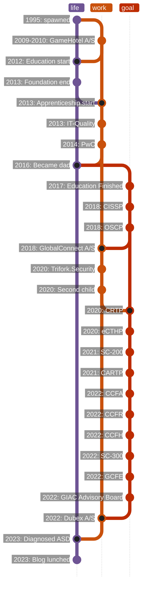

{: .left} 

## > Kevin K. Kragh


 {{ author.worktitle }}  @ {{ author.workplace }}  


    
        
            <a href="mailto:{{ social[1] }}"><i class="fas fa-fw fa-envelope-square"></i>Mail</a>

        
            <a href="https://www.linkedin.com/in/{{ social[1] }}/"><i class="fab fa-fw fa-linkedin"></i>LinkedIn</a>

        
            <a href="https://twitter.com/{{ social[1] }}"><i class="fab fa-fw fa-twitter-square"></i>Twitter</a>

        
            
            <a href="https://{{ mastodon[1] }}/@{{ mastodon[0] }}"><i class="fab fa-fw fa-mastodon"></i>Mastadon</a>

        
            <a href="https://github.com/{{ social[1] }}"><i class="fab fa-fw fa-github"></i>GitHub</a>

        
            <a href="https://gitlab.com/{{ social[1] }}"><i class="fab fa-fw fa-gitlab"></i>GitLab</a>

        
            <a href="{{ social[1] }}"><i class="fas fa-fw fa-link"></i>Personal</a>

    


## $ exiftool minion.data

- :date:  years old
- :briefcase: Working at Dubex
- :closed_lock_with_key: Passion for security
- :denmark: Danish Citizen
- :round_pushpin: Køge, Denmark
- :house: House owner
- :upside_down_face: Big fan of dad jokes
- :pear: Look this one up
- :rotating_light: Incident Responder
- :family_man_boy_boy: Father of two boys
- :medical_symbol: Asperger’s Syndrome
- :motorcycle: Riding motorcycle
- :technologist: Love bits and bytes
- :weight_lifting: Training powerlifting

## $ openssl rand {{ page.content | number_of_words }}

Putting some words on above,  years old and Father of two boys being respectively  and  years old.
I don't consider myself to be an expert at anything, but a generalist knowing a little about a lot, especially within the domains of Cyber Security.
Living by myself (except when I have some quality time with my kids), enjoy lifting heavy riding motorbike and deep diving into technology and security in general.

Started this blog to have a platform to communicate whatever I feel like, without being held back by policy, opinions or whatever that might hinder me. Enabling me with a platform from where I can write long or short articles, messages, and knowledge about whatever comes into mind, and write them ***unfiltered***. Therefore it's important to note that views and opinions expressed on this site are solely mine and do not necessarily represent the views or endorsements of any affiliated organizations, companies, or brands.[^disclaimer]

There is no "post schedule". I post whenever I can and will. When something new arrives, I'll try to share it through my social pages.
I have some awesome colleagues pushing me towards doing this blog, and I'm glad they did!
Hope that at some point this blog can either help or inspire you, or even better, challenge my knowledge and/or understanding of the stuff I write about.

For now, there are no locking on which subjects I'll cover. I just write about whatever I feel for, and hope somebody reads it and finds it relevant and valuable use of their time. A non-prioritized list of subjects likely falling withing my scope of things I'm passionate about and love educating people in.

1. Security trends
2. Incident Response
3. Microsoft Security
4. SIEM & Log Management
5. Detection Engineering
6. Security tooling and scripts
7. EDR and Endpoint Protection
8. Development (Python and PowerShell)
9. Projects (like this blog)
10. Whatever I'm passionate about

### $ git init

Below is a slaughter of what scm is intended for. Anyways, here comes a git history representing commits of my life.
I've likely forgotten something. LinkedIn is properly easier for everybody to read, but where is the fun in that?

## Sources and links

[^disclaimer]: [{{ "/disclaimer/" | absolute_url }}]()
